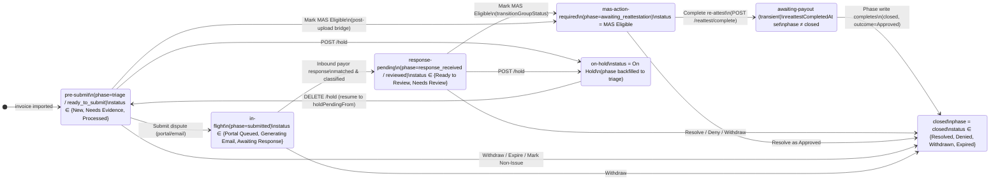

# Invoice Lifecycle Flow

> **Source of truth.** This document is the canonical end-to-end map of an
> invoice group's lifecycle: every phase, every status it can carry inside that
> phase, every operator action available, and the **server-side gates** each
> action requires. Built so that any new client UI predicate can be checked
> against the row labelled "Server gate" — if the two ever drift, the operator
> sees a 409 (or worse, a silently-broken button) and the bug class we keep
> hitting recurs.
>
> Keep this in lock-step with:
>
> - `lib/api-server/src/lib/macro-phase.ts` — `getGroupMacroPhase`
> - `lib/api-server/src/lib/group-transitions.ts` — `VALID_GROUP_STATUS_TRANSITIONS`
> - `artifacts/api-server/src/routes/invoice-groups.ts` — the route 409 gates
> - `lib/leg-state/src/per-leg-sub-status.ts` — `deriveLegSubStatus`
> - `artifacts/claimclear/src/lib/whats-next-derivation.ts` — `canQueueOrCompleteReattest`, `deriveInvoiceDisputeOutlook`

## How to use this map

1. **Locating an invoice.** Read the `(phase, status, reattestCompletedAt, status="On Hold")` tuple. The macro-phase derivation in §1 maps that tuple to one of the seven coloured nodes below.
2. **Predicting what the operator can do.** Every directed edge is an action. Read the gate annotation on the edge — that is the EXACT predicate the server checks before performing the transition.
3. **Catching drift.** When you write a new client predicate that decides whether to render an action button, the predicate must be a subset of the gate on the corresponding edge. Run `pnpm --filter @workspace/api-server exec tsx src/scripts/audit-state-divergence.ts` to scan the live DB for groups where today's UI would surface an action whose server gate would 409.

---

## 1. Phase model



> **Why `awaiting-payout` is transient.** The `phase` column flips
> straight from `awaiting_reattestation` to `closed` on re-attest
> completion. The `awaiting-payout` macro-phase is derived live from
> `reattestCompletedAt IS NOT NULL AND phase != closed` — it usually
> resolves within a single transaction. A row stuck there for >24h is
> almost always a write that committed `reattest_completed_at` without
> the matching `phase = 'closed'` flip; the audit script flags it.

---

## 2. Per-leg sub-status (inner tier)

A leg's sub-status is **derived** from `claims.disposition` (canonical Wave-D
column) with a legacy fallback ladder over `(includedInDispute, errorTypeId,
holdReason, sopOutcome, duplicateOfClaimId)`. See
`lib/leg-state/src/per-leg-sub-status.ts` for the precedence rules.

| Sub-status | Meaning | Operator surface |
| --- | --- | --- |
| `excluded` | `includedInDispute = false` (UI-only flag). Leg is held out of the dispute payload. | Hidden from work surfaces. |
| `duplicate` | Sibling-duplicate of another leg (`duplicateOfClaimId IS NOT NULL`). Verdict follows the primary. | Hidden from work surfaces. |
| `needs_classification` | No `errorTypeId` on the row yet. | Classification Inbox. |
| `investigating` | Has an `errorTypeId` but no terminal `sopOutcome` yet. | SOP walker / verdict picker. |
| `blocked` | `holdReason` set, OR `sopOutcome = 'hold'`. | Held lane. |
| `ready` | Closure landed at `portal_dispute` / `dispute`. Goes into the dispute payload. | Submission gauntlet. |
| `dropped` | Closure landed at `cannot_dispute` / `non_issue`. | Hidden from disputable count. |
| `frozen` | Terminal disposition (`final_*` / `disposed_expired`). Closed-state marker. | Read-only. |

A leg is **resolved** (the gauntlet's gate) iff its sub-status is in
`{ready, dropped, excluded}`, OR it is a `duplicate` whose primary is itself
resolved. Defined in `lib/leg-state/src/leg-resolved.ts` and shared between
the client gauntlet and the server's portal-submission filter — they cannot
drift.

---

## 3. Operator action gates (the divergence checklist)

Every client predicate that decides whether to surface an action MUST be a
subset of the corresponding server gate listed here. When the predicate
returns "show button" but the server returns 409, that's the bug class
this document exists to prevent.

| Action | Server endpoint | Source-state contract | Notes |
| --- | --- | --- | --- |
| Submit dispute | `POST /portal-submissions` | All disputable legs `isLegResolved` per `lib/leg-state/src/leg-resolved.ts`. Group must be in pre-submit phase. | Client gate: `InvoiceGroupSubmissionGauntlet` walks the same `isLegResolved` predicate. |
| Place on hold | `POST /invoice-groups/:id/hold` | `status` ∈ allowed-from-list in `VALID_GROUP_STATUS_TRANSITIONS`. | Bridge UI hides the button when status not in list. |
| Remove hold | `DELETE /invoice-groups/:id/hold` | `status = "On Hold"`. Resumes to `holdPendingFrom`. | Idempotent; hidden when status ≠ On Hold. |
| Mark MAS Eligible | `POST /invoice-groups/:id/mark-mas-eligible` | `status` ∈ `{New, Needs Review, Awaiting Response}`. NOT from `Needs Evidence` or `On Hold`. | Bridge UI hides button when group is already MAS Eligible. Side-effect: `engageMasEligibleAttestationCascade` flips disputed legs to `attestation_state = 'pending'`. |
| Mark "I replied — wait for payor again" | `POST /invoice-groups/:id/awaiting-payor-again` | `status = "Needs Review"` AND ≥1 inbound `portal_responses` row. | Stamps `awaitingPayorAgainAt`; row drops off Responses Awaiting Review until a newer response lands. |
| **Bulk-queue re-attest** | `POST /invoice-groups/:id/reattest/queue` | `(macroPhase = "response-pending" AND status = "Needs Review")` OR `macroPhase = "mas-action-required"`. The `response-pending` arm additionally requires ≥1 inbound `portal_responses` row. | **Client gate (must mirror exactly):** `canQueueOrCompleteReattest` in `whats-next-derivation.ts`. Drift here is what produced the May 8 1000-item-day 409. |
| **Complete re-attest** | `POST /invoice-groups/:id/reattest/complete` | `macroPhase = "mas-action-required"` AND every leg with `masActionRequired = "cancel"` has `masActionCompletedAt`. | Same client gate as bulk-queue. Admin override path: `recordedOffline = true` + 10-char `offlineNote` + admin role. |
| Close as Resolved/Denied/Withdrawn/Expired | `PATCH /invoice-groups/:id/status` | `status` ∈ allowed-from-list. ALSO: no leg may be `On Hold` (`ensureNoHeldLegsBeforeClosure`) and no in-flight `portal_submissions` (`checkActiveSubmissions`). | Side-effects: `autoExcludeUnclassifiedOnTerminalClose` clears any stranded `needs_classification` leg before the row turns terminal. |

### 3a. The Re-attest gate spelled out

The single most-painful drift case. The server's gate
(`invoice-groups.ts` ~L3810-3852) is:

```
sourcePhase = getGroupMacroPhase(group)
isResponsePending  = sourcePhase === "response-pending"
                     && group.status === "Needs Review"
isMasActionRequired = sourcePhase === "mas-action-required"
accept iff isResponsePending OR isMasActionRequired
```

The client mirror (`canQueueOrCompleteReattest` in `whats-next-derivation.ts`)
re-implements `getGroupMacroPhase` inline rather than reusing the client's
`getGroupLifecyclePhaseFromGroup` because the latter folds `awaiting-payout`
back into `mas-action-required` and would mis-classify a re-attested group
as eligible.

**Blocking phases the client surfaces in plain English:**

| macroPhase | UX message |
| --- | --- |
| `on-hold` | This invoice is on hold — release the hold before re-attesting. |
| `awaiting-payout` | Re-attestation has already been recorded — waiting on payout, no further action here. |
| `closed` | This invoice is closed — no further re-attestation is possible. |
| `in-flight` | Waiting on the payor — re-attestation unlocks once a response lands and is routed for review. |
| `pre-submit` | This invoice hasn't been submitted to the payor yet. |
| `response-pending` (Ready to Review only) | The payor response hasn't been routed for review yet — refresh in a moment, or pick it up from the Responses Awaiting Review page. |

---

## 4. Per-claim audit

Run the audit script to scan every invoice group in the DB and flag any row
whose current state would produce a UI/server divergence:

```bash
pnpm --filter @workspace/api-server exec tsx \
  src/scripts/audit-state-divergence.ts            # dry-run report
pnpm --filter @workspace/api-server exec tsx \
  src/scripts/audit-state-divergence.ts --json     # machine-readable
```

The script writes one row per finding to stdout, grouped by check name. The
checks it runs are listed in the script's header docblock; extending the
script with a new check is the right move whenever this document gains a
new row in §3.
