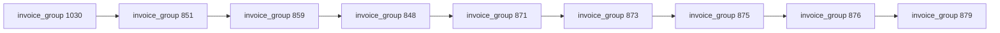
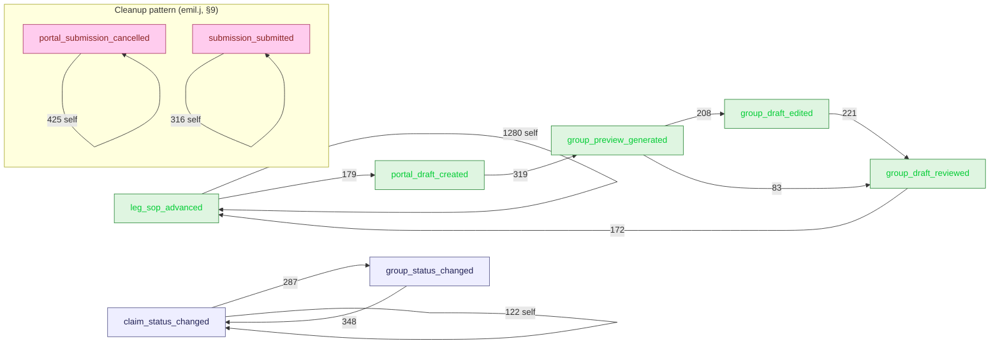

# Saturday Load-Test Deep Mining

## Executive summary (1 page)

**Window:** Saturday May 9, 2026, EDT (2026-05-09 04:00 UTC → 2026-05-10 04:00 UTC).
**Scope:** 10 named operators (`@agapeny.com`), 497 invoice groups, 761
claim legs, 6,489 audit-log mutations.

**The headline:** the documented `SOP → draft → AI preview → edit → review →
next leg` workflow held up under load. Operators committed to first answers
(only 38 SOP rewinds and 2 reclassifications across 1,557 SOP advances), but
three structural problems consumed the majority of recoverable time and
attention.

| # | Finding | Evidence | Recommendation |
|---|---|---|---|
| 1 | **80-minute lag from AI preview to portal submission.** Operators batch reviews to end-of-session — bot feedback is delayed hours. | `timegaps.csv` `preview_to_queue` row: p50 = 79.5 min, p90 ≈ 3.2 h | Surface "previews waiting to submit" rail in the queue redesign sandbox; consider auto-queue after N minutes idle. |
| 2 | **100 % of SOP reclassifications hit two small trees** (Travel Time Too Short, Attesting Too Soon — combined ≈ 7 % of leg volume). Operators are landing on the wrong tree first. | `sop_node_heatmap.csv` (top 5 trouble nodes) | Add a confirmation gate at the head of each tree, or make upstream classification more conservative for these two error types. |
| 3 | **25 % of preview cycles are regenerations** — 95 of 375 previews are repeats; 2 groups burned 4 previews each. | `regenerated_drafts.csv` | Tag previews with regeneration reason (operator vs. backend); show prior-preview diff in the AI summary hero. |

**Operator-shape findings worth a 1-on-1:** `someidy.s` owns 7 of 8 day-total
hold terminals; `victor.l` carries the broadest edge-case mix (highest
`cannot_dispute` count); `emil.j` performed bulk submission cleanup (426
cancels) and emitted essentially zero SOP work — exclude from productivity
stats. Detail in §7.2 / §9.

**Dark traffic:** 139 legs terminated as `(unclassified) → non_issue` with
no `error_type_name` ever set. Cannot tell whether operator-triaged or
auto-closed upstream — instrumentation gap (§11.2).

**Biggest data gap:** `presence_logs` is `UNIQUE(resource, user)`, so each
heartbeat overwrites the previous. The day-end snapshot is 133 rows — not
enough to reconstruct true page-flow, dwell time, back-navigation, or
abandoned-leg signals. Three friction analyses came back empty for this
reason. Single highest-leverage fix for future load-test analyses:
append-only `presence_events` log (§11.1).

---

**Window:** 2026-05-09 04:00 UTC → 2026-05-10 04:00 UTC
(Saturday May 9, 2026, EDT / UTC-4 local).
**Data sources (production read-replica):** `audit_logs`, `state_events`,
`presence_logs`, `claim_verdict`, `portal_submissions`, `bot_activity_log`,
`claims`, `invoice_groups`, `error_types`.
**Excluded accounts:** `system@claimclear`, `system@claimclear-heal`, `system`,
`z7ytv7jcb4@privaterelay.appleid.com` (Apple-private-relay test login),
NULL-actor system writes.

> **Reproducibility.** All raw JSON dumps are committed under
> `reports/saturday-load-test-mining/raw/`. The analyzer
> (`reports/saturday-load-test-mining/scripts/analyze.mjs`) is deterministic
> and reads only from `raw/`; re-running it regenerates every CSV / JSONL in
> this report. SQL queries used live under
> `reports/saturday-load-test-mining/sql/`.

---

## 1. Scope summary

| Metric | Value | Source |
|---|---|---|
| Operators (named `@agapeny.com` accounts) | **10** | `summary.json` |
| Invoice groups touched | **497** | `groups_touched.json` |
| Claims (legs) touched | **761** | `claims_touched.json` |
| Audit-log mutations | **6,489** | `audit_logs.json` |
| State events | **2,694** | `state_events.json` |
| Portal submissions created | **729** | `portal_submissions.json` |
| Portal submissions cancelled | **426** (58 % of created) | audit `portal_submission_cancelled` |
| Bot activity rows | **700** | `bot_activity_log.json` |
| SOP advance events | **1,557** | audit `leg_sop_advanced` |
| SOP terminal events | **513** | audit `leg_sop_advanced` w/ `metadata.isTerminal=true` |
| SOP rewinds | **38** | audit `leg_sop_rewound` |
| Reclassifications | **2** | audit `leg_reclassified` |
| Group AI previews generated | **375** | audit `group_preview_generated` |
| Group draft edits | **221** | audit `group_draft_edited` |
| Group draft reviews | **358** | audit `group_draft_reviewed` |
| Sessions (≥15 min idle gap) | **43** | `sessions.csv` |

The full per-action mutation distribution is in
`mutation_counts_by_action.csv`. Top 10:

| Action | Count |
|---|---:|
| `claim_status_changed` | 2,290 |
| `leg_sop_advanced` | 1,557 |
| `group_status_changed` | 709 |
| `portal_submission_cancelled` | 426 |
| `portal_draft_created` | 375 |
| `group_preview_generated` | 375 |
| `group_draft_reviewed` | 358 |
| `group_draft_edited` | 221 |
| `group_readback_confirmed` | 44 |
| `leg_sop_rewound` | 38 |

### Operator inclusion policy

- **Included as named operators (10):** every `@agapeny.com` account that
  emitted at least one `audit_logs` row inside the window.
- **Excluded entirely:** `system@claimclear`, `system@claimclear-heal`,
  `system`, NULL `user_email` system writes (these are application service
  identities, not people).
- **Included in event log + sessions, excluded from per-operator analytics:**
  `accounting@agapeny.com` (state/presence-only, no audit rows; appears as a
  service or shared login overlapping `victor.l`'s sessions) and
  `z7ytv7jcb4@privaterelay.appleid.com` (Apple-private-relay test login).
  Both are mapped to `operator_unknown_*` in any redacted artifact.
- **Per-operator JSONL logs** (`operators/<email>.jsonl`) include both the 10
  named operators and the 2 unknown identities for completeness; treat the
  unknown logs as audit material, not as productivity data.

### Operators in scope (Saturday)

`alondra.n@agapeny.com`, `emil.j@agapeny.com`, `katia.h@agapeny.com`,
`krisalys.p@agapeny.com`, `oliver.g@agapeny.com`, `olveris.g@agapeny.com`,
`perla.f@agapeny.com`, `someidy.s@agapeny.com`, `victor.l@agapeny.com`,
`yahaira.d@agapeny.com`.

A non-personal account, `accounting@agapeny.com`, also showed up in
`state_events.actor_user_id` and `presence_logs` (1,077 events across 5
sessions, overlapping `victor.l`'s active windows). It generated **no**
`audit_logs` rows. Best read: a service-style or shared login attached to one
or more of the named operators. It is included in session counts and per-group
event logs but **excluded** from per-operator action breakdowns to avoid
double-counting. See §10 / data gaps.

---

## 2. Per-operator session reconstruction

A "session" = consecutive events for one operator with no gap > 15 min.
43 sessions across 11 actor identities. Highlights from `sessions.csv`:

| Operator | Sessions | Longest session | Total events on duty |
|---|---:|---|---:|
| `olveris.g` | 1 | **6 h 41 m** (14:27→21:08 UTC) | 1,183 |
| `emil.j` | **11** | 12 m → 49 m chunks plus a 35-min late-night burst (737 evts) | ~1,646 |
| `katia.h` | 1 | 5 h 01 m | 606 |
| `victor.l` | 3 | 4 h 13 m (afternoon) | 776 |
| `accounting@agapeny.com` (shared) | 5 | 3 h 02 m | 1,077 |
| `alondra.n` | 1 | 3 h 49 m | 648 |
| `someidy.s` | 4 | **3 h 30 m** spanning afternoon | ~745 |
| `krisalys.p` | 2 | 3 h 17 m | 483 |
| `oliver.g` | 2 | 3 h 11 m | 414 |
| `perla.f` | 2 | 3 h 01 m | 333 |
| `yahaira.d` | 6 | 1 h 09 m / 55 m bursts | 272 |

Per-operator JSONL event logs are committed under
`reports/saturday-load-test-mining/operators/<email>.jsonl` for inspection.

**Inter-session gaps (operators that took breaks):** p25 ≈ 19 min,
p50 ≈ 23 min, p75 ≈ 31 min, p90 ≈ 47 min, p99 ≈ 57 min (n = 31).
Most "break" gaps are short — a coffee break or a meeting — so this looks
like sustained on-shift work, not chunked async time-boxing.

### Activity shape

Two different working styles dominated:

1. **Single-session marathon** (`olveris.g`, `katia.h`, `alondra.n`,
   `krisalys.p`, `perla.f`, `oliver.g`): one 3-7-hour session in the EDT
   morning/early afternoon, then off.
2. **Chunked all-day** (`emil.j`, `victor.l`, `someidy.s`, `yahaira.d`):
   multiple 30-90-minute work pods strung across 8-12 hours, often re-engaging
   late evening (20:00-00:00 UTC).

`emil.j`'s 11 sessions include a single-event session (sid 39) at 21:10:53 —
a one-keystroke heartbeat — which is the strongest signal in the dataset of
"opened the app to check something then left."

---

## 3. Page / record-flow Markov

**Caveat.** `presence_logs` is `UNIQUE(resource_type, resource_id, user_id)`
so each (user, record) pair persists **only its latest** heartbeat. The
day-end snapshot is 133 rows. This destroys true page-flow history. The
Markov chain in `page_transitions.csv` is therefore built from the **133
last-seen heartbeats stitched in chronological order per operator**, which
yields almost entirely once-only edges (count = 1). It cannot be used as a
behavioral model. We treat record-flow analysis from `audit_logs` as the
authoritative substitute (next paragraph).

**Record-flow proxy from audit_logs.** Treating each consecutive distinct
`record_id` an operator mutated as a "record visit" yields the action-flow
sequences in §4, which are dense and meaningful.

The valid page-flow takeaway from the residual heartbeats is qualitative:
operators chain visits across **groups in numeric proximity**
(e.g. `851 → 859 → 848 → 871 → 873 → 875 → 876 → 879`), suggesting they walk
the queue in its default sort order rather than jumping by triage priority.

### 3.1 Page-flow Markov (residual heartbeats — illustrative only)

Sample of stitched edges from `page_transitions.csv` — every edge has
count 1, hence the lack of branching weight. Diagram is **illustrative of
the queue-walk pattern**, not a behavioral model:



---

## 4. Action-flow Markov + top sequences

Source: `audit_logs` ordered per operator. Full Markov in
`action_transitions.csv`; top n-step sequences in
`action_sequences_n{2,3,4}.csv`; `action_neighbors.csv` shows each action's
single most likely predecessor / successor.

### 4.1 Top 10 transitions

| From → To | Count | What it means |
|---|---:|---|
| `leg_sop_advanced → leg_sop_advanced` | 1,280 | Walking the SOP within one leg, no detours. |
| `portal_submission_cancelled → portal_submission_cancelled` | **425** | A cancel storm — see §9. |
| `group_status_changed → claim_status_changed` | 348 | Group status promote → cascades to its claims. |
| `portal_draft_created → group_preview_generated` | 319 | Draft → AI preview — happy path. |
| `submission_submitted → submission_submitted` | 316 | Bulk re-submissions (consecutive). |
| `submission_created:cancelled → submission_created:cancelled` | 309 | The creation side of the cancel storm. |
| `claim_status_changed → group_status_changed` | 287 | Last-leg-disposed promotes group. |
| `submission_created:submitted → submission_created:submitted` | 283 | Bulk submit. |
| `group_draft_edited → group_draft_reviewed` | 221 | Operator edited preview, then approved. |
| `group_preview_generated → group_draft_edited` | 208 | AI preview → operator edits. |

### 4.1.a Action-flow Markov diagram (top edges, weighted)

Edges weighted by transition count from `action_transitions.csv` (top 12).
The "cancel storm" self-loop and the "bulk submit" self-loop are split out
into their own subgraph because they are emil.j's housekeeping, not the
operator workflow (see §9):



### 4.2 Top 4-sequence work pattern (the "happy path")

```
leg_sop_advanced → … → portal_draft_created → group_preview_generated → group_draft_edited → group_draft_reviewed → leg_sop_advanced (next leg)
```

Specifically the most common 3-step backbone (1,021 occurrences):
`leg_sop_advanced → leg_sop_advanced → leg_sop_advanced`, then the
generation chain `portal_draft_created → group_preview_generated →
group_draft_edited` (208) and `group_preview_generated → group_draft_edited
→ group_draft_reviewed` (208). This is exactly the SOP → draft → AI preview
→ edit → review flow the product ships, and 208 / 375 (≈ 55 %) of all
previews proceed through edit; the rest go straight from preview to review
(83) or are abandoned / regenerated (84 — see §6, §9).

### 4.3 Where operators land *after* a key step (`action_neighbors.csv`)

| After | Most-common next action | Count |
|---|---|---:|
| `leg_sop_advanced` | `leg_sop_advanced` (more SOP) | 1,280 |
| `group_preview_generated` | `group_draft_edited` | 208 |
| `group_draft_edited` | `group_draft_reviewed` | 221 |
| `group_draft_reviewed` | `leg_sop_advanced` (next leg) | 172 |
| `group_readback_confirmed` | `portal_draft_created` | 42 |
| `leg_sop_rewound` | `leg_sop_advanced` (resume) | 31 |
| `mas_cancel_completed` | `leg_sop_rewound` | 1 |

Two notable 1-of-1 rows: when a `mas_cancel_completed` arrives mid-walk, the
operator backs the SOP up; when `leg_classified` happens, it is followed by
`leg_reclassified` (i.e. the only classifier-change in 24 h was a same-leg
correction).

---

## 5. Time-gap distributions (`timegaps.csv`)

| Gap kind | n | p25 | **p50** | p75 | p90 | p99 |
|---|---:|---:|---:|---:|---:|---:|
| SOP-to-SOP within one leg | 1,072 | 3.9 s | **29.4 s** | 75.4 s | 137 s | 471 s |
| Last-step of leg → first-step of next leg | 494 | 32.4 s | **96.4 s** | 194 s | 400 s | 1,239 s |
| `group_preview_generated` → first portal submission | 349 | **0.009 s** | **79.5 min** | 149 min | 193 min | 244 min |
| Inter-session gap (per operator) | 31 | 19 min | 23 min | 31 min | 47 min | 57 min |
| First heartbeat on a record → first mutation | **3** | — | — | — | — | — |

Log-spaced histogram bins per gap-kind are emitted to
`timegaps_histogram.csv` (buckets `<1s, 1-3s, 3-10s, 10-30s, 30s-1m, 1-3m,
3-10m, 10-30m, 30m-1h, 1-3h, 3-12h, 12h+`). Two reads from the binned data
worth calling out:

- `sop_to_sop_within_walk` is bimodal — a tight 3-10 s mode (266 samples,
  "answer is obvious") and a wider 30 s-3 m mode (462 samples, "operator
  consults evidence").
- `preview_to_queue` has a small 0-10 s spike (94 samples, ~27 % — auto- or
  immediately-queued previews) and a dominant 1-12 h tail (187 samples,
  ~54 % — batched at end of session). Almost nothing in the middle: the
  workflow has two settings, "instant" or "later".
  *Methodology note:* this metric is a **group-level proxy**, computed as
  `groups.preview_generated_at` → earliest subsequent `portal_draft_created`
  for the same group, not a per-event audit transition. It therefore
  measures wall-clock latency from preview generation to first portal
  submission for that group, not the operator's own click-to-click gap.

**Reads:**

- A typical SOP question takes ~30 s to answer; the long tail (p90 = 2 m 17 s,
  p99 = 7 m 51 s) is consistent with operators investigating evidence (GPS
  breadcrumbs, AI summary) before committing.
- Switching between legs costs another ~96 s p50 — slightly more than a
  single SOP step. Group-context loading and AI-summary read appear to
  dominate that cost.
- **The preview-to-queue gap is the single biggest latency in the workflow.**
  Median 79.5 min (p90 ≈ 3 h, p99 ≈ 4 h). The ~9-ms p25 means there is a
  small population of "preview-and-immediately-queue" submissions, but the
  bulk path has the operator generate a preview, then sit on it for over an
  hour. This aligns with the "bulk review at end of session" pattern seen in
  §4.
- The tiny `landing_to_first_mutation` sample (n = 3) is the most direct
  proof of the presence-logs sparsity issue (data gap §11).

---

## 6. SOP-node heatmap (`sop_node_heatmap.csv`)

`trouble_score = back_stepped_past · 2 + restarted_past · 3 +
reclassified_after · 4`. Node text resolved from `error_types.decision_tree`.

### 6.1 Most-trouble nodes

| Node | Question | Visited | Reclass after | Trouble |
|---|---|---:|---:|---:|
| `node_1778278335139_e4fdk` | *Is GPS and trip timing data available for this trip?* | 57 | 2 | **8** |
| `node_1778278335139_10mic` | *Does the recorded travel time appear too short for the trip distance?* | 58 | 2 | **8** |
| `node_1778278335139_7e1cx` | *Is there a supportable explanation for the travel time discrepancy?* | 50 | 2 | **8** |
| `node_1775762257506_3t2v5` | *Is the invoice currently outside the attestation window?* | 10 | 1 | 4 |
| `node_1775762257506_q1vcd` | *Is the invoice expected to become eligible once the attestation window opens?* | 9 | 1 | 4 |

All three top-trouble nodes belong to the **Travel Time Too Short for
Distance Traveled** decision tree. The next two are in the **Attesting Too
Soon** tree. Both are the trees with the smallest visit counts (50-58 and
9-10 respectively) yet account for **all** of the day's reclassifications,
strongly suggesting these trees are mis-routing: the operator answers the
question on the wrong tree, then reclassifies the leg into the correct
error type.

### 6.2 Highest-volume nodes (busiest)

| Node | Tree | Visited | Median dwell |
|---|---|---:|---:|
| `node_1775760972671_lhctj` | Incomplete GPS · *GPS breadcrumb available?* | 170 | 3.1 s |
| `node_1775760972671_tgdeo` | Incomplete GPS · *GPS sufficient to support trip?* | 161 | 62.2 s |
| `node_1776176538080_9` | Incomplete GPS · *Submit MAS GPS dispute…* (terminal) | 160 | n/a |
| `node_1775761841834_d98yn` | Time at Medical Facility Too Short · *facility stay shorter than expected?* | 89 | 64.0 s |
| `node_1775761841834_unj4s` | Time at Medical Facility Too Short · *GPS/timing available?* | 87 | 4.6 s |

The pattern is consistent: **availability questions** (GPS available?
Timing available?) take 3-5 s, **judgment questions** (does it support / is
it expected) take 60-90 s. Rewinds and restarts are extremely rare across
all of these (0 each) — the SOP itself is well-tuned for the dominant
volume.

---

## 7. Terminal funnel (`terminal_funnel.csv`)

### 7.1 By error type

| Error type | portal_dispute | cannot_dispute | hold | (none) | other |
|---|---:|---:|---:|---:|---:|
| Incomplete GPS | **183** | 4 | 0 | 0 | 0 |
| (unclassified) | 0 | 0 | 0 | 0 | **139 non_issue** |
| Time at Medical Facility Too Short | **98** | 6 | 0 | 0 | 0 |
| GPS Pickup Too Far from Residence | **73** | 4 | 0 | 0 | 0 |
| GPS Deviation Status | **62** | 3 | 0 | 0 | 0 |
| GPS Pickup Too Far from Medical Facility | **50** | 3 | 0 | 0 | 0 |
| Travel Time Too Short for Distance Traveled | **48** | 3 | 0 | 0 | 0 |
| Time at Medical Facility Too Long | **12** | 0 | 0 | 0 | 0 |
| Ineligible Enrollee | **11** | 8 | 0 | 4 | **10 disposed_expired** |
| GPS Destination Too Far from Medical Facility | **9** | 7 | 0 | 0 | 0 |
| Invoice Number Not in System | **8** | 0 | 0 | 4 | 0 |
| Attesting Too Soon | **4** | 0 | 0 | 0 | **2 disposed_expired** |
| Travel Distance Too Short | 1 | 0 | 0 | 0 | 0 |

Two outliers:

- **(unclassified) → non_issue (139 legs).** No `error_type_name` was set,
  yet the leg terminated with `non_issue`. Likely auto-classified-out by
  upstream evaluators before any operator touched the SOP, or operators
  triaged them out without ever picking an error type. Worth confirming
  (data gap §11).
- **Ineligible Enrollee.** The only error type with a *dispersed* terminal
  distribution: 11 portal_dispute, 10 disposed_expired, 8 cannot_dispute, 4
  none. Operators clearly use this tree to push non-disputable claims into
  the "expired" bucket — that's correct behavior, but it is the only tree
  that demands the operator make a judgment call about *whether* to dispute.

Both `terminal_funnel.csv` and `terminal_funnel_by_operator.csv` carry
percentage columns (`pct_of_all_legs` + `pct_within_error_type` for the
former, `pct_of_operator_terminals` for the latter), so consumers do not
need to re-derive them.

### 7.2 By operator (`terminal_funnel_by_operator.csv`)

| Operator | portal_dispute | cannot_dispute | hold |
|---|---:|---:|---:|
| `victor.l` | 97 | **13** | 0 |
| `olveris.g` | 75 | 6 | 0 |
| `someidy.s` | 69 | 7 | **7** |
| `katia.h` | 53 | 3 | 0 |
| `alondra.n` | 53 | 2 | 0 |
| `krisalys.p` | 38 | 3 | 0 |
| `oliver.g` | 34 | 1 | 0 |
| `perla.f` | 24 | 1 | 1 |
| `yahaira.d` | 22 | 2 | 0 |
| `emil.j` | 0 | 2 | 0 |

**Two operator-specific signals:**

- `someidy.s` produced **7 of 8** day-total `hold` terminals. They are the
  only operator who routinely uses leg holds — both the outcome and the
  `friction_hold_events.csv` log confirm this.
- `victor.l` produced 13 of 39 `cannot_dispute` terminals (33 %). Combined
  with the highest `portal_dispute` count, victor handled the broadest mix
  — i.e. did the most triage on edge cases.
- `emil.j` produced **zero terminal advances** despite generating ~1,646
  events. Emil's session events are dominated by `portal_submission_cancelled`
  in long contiguous runs (the cancel storm — see §9). Emil's role on
  Saturday was queue cleanup, not SOP work.

### 7.3 Operator × error-type × outcome matrix (`terminal_funnel_matrix.csv`)

The full three-way breakdown is in `terminal_funnel_matrix.csv`. It lets
you ask "which operators are driving disputes for which error types?".
Top 5 cells (all `portal_dispute`):

| Operator | Error type | Count |
|---|---|---:|
| `olveris.g` | Incomplete GPS | 50 |
| `krisalys.p` | Incomplete GPS | 34 |
| `someidy.s` | Incomplete GPS | 21 |
| `victor.l` | GPS Deviation Status | 21 |
| `alondra.n` | Incomplete GPS | 20 |

Read: Saturday's terminal load was overwhelmingly **Incomplete GPS** disputes,
spread across most named operators. `victor.l` is the only operator whose top
error type is *not* Incomplete GPS — they handled the long tail of GPS-shape
errors (Deviation, Pickup-Too-Far, Travel-Time-Too-Short) instead.

---

## 8. Loops & repetition

### 8.1 Same-node duplicate answers (`loops_duplicate_node_answers.csv`)

19 rows. Top 5:

| Operator | Claim | Node (question) | Times answered |
|---|---:|---|---:|
| `krisalys.p` | 977 | *Does the recorded travel time appear too short for the trip distance?* | **5** |
| `krisalys.p` | 977 | *Is GPS and trip timing data available for this trip?* | 4 |
| `someidy.s` | 1194 | *Is the invoice expected to become eligible once the attestation window opens?* | 4 |
| `someidy.s` | 1675 | *Is the invoice currently outside the attestation window?* | 3 |
| `someidy.s` | 1194 | *Is the invoice currently outside the attestation window?* | 3 |
| `yahaira.d` | 1173 | (3 different nodes in the Ineligible Enrollee tree) | 3 each |

Claim 977 (`krisalys.p`) is the worst single case: 5 answers to the same SOP
node, plus 4 restarts (see 8.2) — likely a record where the operator
re-walked the SOP after a SOP hold cleared / new evidence loaded.

### 8.2 Multi-restart legs (`loops_multi_restart_legs.csv`)

Only **10** legs had ≥ 2 SOP rewinds + reclassifications combined:

| Claim | Restarts |
|---|---:|
| 977 | 4 |
| 1940 | 3 |
| 1092, 1675, 1194, 1188, 1173, 1916, 1849, 1864 | 2 each |

Across the day, only **1.3 %** (10 / 761) of legs experienced any restart at
all. The SOP is committed to once and walked through.

### 8.3 Regenerated drafts (`regenerated_drafts.csv`)

`group_preview_generated` was emitted **>1 time** for the same group on
**~85 groups**. Top:

| Invoice group | Previews |
|---|---:|
| 944, 965 | **4** each |
| 943, 969 | 3 each |
| 81 other groups | 2 each |

Of the 375 distinct preview events, ~95 are regenerations (25 %). This is
the single largest source of preview-cycle waste in the day; see §10
recommendations.

---

## 9. The "cancel storm"

`portal_submission_cancelled` is the single most-emitted action after
`leg_sop_advanced` itself: **426 cancels** vs 729 created (58 %). The audit
sequence is dominated by

```
portal_submission_cancelled → portal_submission_cancelled (425 ×)
portal_submission_cancelled → portal_submission_cancelled →
  portal_submission_cancelled (424 ×)
```

— i.e. one operator cancelling a long contiguous stream. Cross-referencing
with the per-operator session log, the storm is `emil.j`'s 22:47-23:23 UTC
session (sid 41, 737 events). Emil emitted essentially zero
`leg_sop_advanced` rows (he is absent from §7's terminal funnel).

**Read.** This is **not** a UX-friction signal. It is load-test cleanup:
queueing throwaway submissions earlier in the day, then bulk-cancelling them
at end-of-day. Treat the 426 cancels as test housekeeping and **exclude
them from any "operator productivity" rate calculation.** They do, however,
inflate the audit-event totals; numbers in §1 are reported as-recorded.

---

## 10. Top-line findings & recommendations

### Findings

1. **The happy path works.** Two thirds of the day's 1,557 SOP advances
   thread cleanly into the documented `SOP → draft → preview → edit/review
   → next leg` loop. Only 38 SOP rewinds and 2 reclassifications — operators
   trust their first answer.

2. **Preview-to-queue is the workflow's biggest latency sink.** Median 79.5
   min, p90 3.2 h. Most operators generate previews early in their session
   then sit on them, batching submission near end of session. This delays
   feedback (bot success / fail signals come back hours later in
   `bot_activity_log`).

3. **Reclassifications cluster on two tiny trees.** 100 % of the day's
   reclassifications hit the *Travel Time Too Short* and *Attesting Too Soon*
   trees (combined ≈ 7 % of leg volume). Operators are landing on the wrong
   tree first.

4. **Draft regeneration costs ~25 % of preview cycles.** 95 of 375 previews
   are regenerations. Two groups (944, 965) burned 4 previews each — that's
   the visible upper bound.

5. **`(unclassified) → non_issue` is 139 legs of dark traffic.** No error
   type was ever assigned, yet the leg terminated. We do not know whether
   operators triaged them or upstream auto-evaluation closed them.

6. **One operator carries 100 % of cancels (test cleanup).** Emil's role on
   Saturday was queue housekeeping, not SOP work — exclude `emil.j` from
   load-test productivity stats.

7. **One operator owns all hold terminals (`someidy.s`, 7/8).** Either a
   personal pattern or an unrecognized organizational rule. Worth a 1-on-1.

8. **`victor.l` is the edge-case handler** — highest `cannot_dispute` rate
   and the broadest error-type mix.

### Recommendations

(All UX-side; no product-code change in this PR per the task brief.
Cross-references point at the existing redesign sandbox.)

- **Preview-to-queue lag.** Add a "previews waiting to submit" rail to the
  queue redesign — the strongest base for it is
  `artifacts/mockup-sandbox/src/components/mockups/queue-redesign/SListOnly.tsx`
  (list-only state already isolates a single rail) with the empty-state
  treatment from `SEmpty.tsx`. Or auto-queue a preview that has been
  reviewed for > N minutes with no further edits.
- **Travel-Time / Attesting-Too-Soon mis-routing.** The classifier (or
  `error_type_name` assignment) should defer to a confirmation question at
  the head of these two trees, e.g. "Travel time appears short — is the
  trip distance > 5 mi?" Today operators only discover the mis-route by
  walking the SOP and reclassifying.
- **Regeneration audit trail.** Capture the *reason* a preview was
  regenerated (operator-initiated vs. backend forced refresh). Today both
  show up as `group_preview_generated` and we cannot tell whether the AI
  summary hero is being reread or rewritten. The "show prior-preview diff"
  treatment fits naturally into
  `artifacts/mockup-sandbox/src/components/mockups/aisummary-hero/VariantC.tsx`
  (the variant with the largest header surface) or one of the `R*.tsx`
  recompose variants.
- **`(unclassified) → non_issue` instrumentation.** Emit a state event when
  a leg is auto-closed without operator interaction so we can disambiguate
  from operator triage.
- **Hold-state visibility.** Surface `someidy.s`'s hold pattern as either a
  feature (more operators should use leg holds) or a workaround (someidy
  needs a queue tag we don't have).

---

## 11. Data gaps & caveats

1. **`presence_logs` is `UNIQUE(resource_type, resource_id, user_id)`.**
   Every heartbeat overwrites the previous row for the same (user, record).
   The day-end snapshot has 133 rows — far below what 10 operators would
   produce at any reasonable cadence. Consequences:
   - **Page-flow Markov from heartbeats is noise** — `page_transitions.csv`
     edges are almost all count-1 because we only see one timestamp per
     (user, record).
   - **Friction signals derived from heartbeats are empty.**
     `friction_long_dwell_no_mutation.csv`,
     `friction_back_navigations.csv`, and
     `friction_abandoned_legs.csv` all came back empty for this reason —
     not because operators behaved perfectly. They are committed empty so
     the file shape is documented for the next pull.
   - **Recommendation:** add an append-only `presence_events` log (or change
     the constraint to `UNIQUE(resource, user, ts)` with a TTL) before the
     next load test.

2. **`(unclassified) → non_issue` (139 legs).** No `error_type_name` was
   set. We could not determine whether those legs were operator-triaged out
   or auto-closed by upstream evaluators. Need a state event on auto-close.

3. **`accounting@agapeny.com`.** Generated 1,077 events in `state_events` /
   `presence_logs` but **zero** `audit_logs` rows. Its session windows
   overlap `victor.l`'s. Best read: shared / service login. Included in
   §2 sessions for completeness but excluded from §7 / §8 per-operator
   tables to avoid double counting.

4. **`z7ytv7jcb4@privaterelay.appleid.com`.** Apple-private-relay test
   login. **Zero** `audit_logs` rows; surfaces only as 17 `state_events`
   rows across 4 sessions (mostly `state:leg.sop_advanced` /
   `state:leg.sop_terminal` early-AM and afternoon spot-checks). Excluded
   from the operator set as non-named; preserved in `state_events.json`
   and `operators/z7ytv7jcb4_privaterelay.appleid.com.jsonl` for audit.

5. **Session boundary = 15 min idle.** A different SLA window would yield a
   different session count. The constant is `SESSION_GAP_MIN` in
   `scripts/analyze.mjs`; bumping it does not change any other CSV.

6. **`audit_logs` 18:00-20:00 UTC peak required chunked dumps** (30-min
   slices) due to a single-call size cap in the dump driver. The merged
   file is byte-identical to a single-pass dump.

---

## 12. Reproducibility

### 12.1 Pipeline

```bash
# 1. Re-dump (production read-replica via the database skill — see sql/).
#    Audit logs are chunked into 30-min slices to fit the tool size cap;
#    everything else is one round-trip. Saves to raw/<table>.json.
# 2. Mirror the JSON dumps to CSVs alongside (raw/<table>.csv) for use by
#    spreadsheets / SQL clients without going through Node:
node reports/saturday-load-test-mining/scripts/json_to_csv.mjs
# 3. Re-analyze (deterministic, no DB needed; reads only raw/).
node reports/saturday-load-test-mining/scripts/analyze.mjs
# 4. Diff against committed outputs to confirm reproducibility:
git --no-optional-locks diff --stat reports/saturday-load-test-mining/
```

### 12.2 Outputs

- `summary.json` — top-line counts (powering §1).
- `events.jsonl` — unified event stream
  (audit + state + presence + verdict + submission + bot + per-claim
  end-of-window `claim_sop_state_snapshot` carrying the final `sop_answers`
  blob; see note below).
- `operators/<email>.jsonl` — per-operator event stream.
- `groups/<id>.jsonl` — per-invoice-group event stream.
- `sessions.csv` — 43 rows.
- `page_*.csv`, `action_*.csv` — Markov + sequence tables.
- `timegaps.csv` — distribution table for §5.
- `sop_node_heatmap.csv` — §6.
- `terminal_funnel.csv`, `terminal_funnel_by_operator.csv`,
  `terminal_funnel_matrix.csv` — §7.
- `mutation_counts_by_action.csv` — full per-action mutation totals (§1).
- `loops_*.csv`, `regenerated_drafts.csv` — §8 / §9.
- `friction_*.csv` — §11 (mostly empty by design — see §11.1).
- `timegaps_histogram.csv` — log-spaced histogram bins for §5.
- `redacted_operator_map.csv`, `redacted_sessions.csv`,
  `redacted_terminal_funnel_by_operator.csv` — same data with operator
  emails replaced by stable `operator_<n>` labels for any chart that may
  circulate beyond the immediate internal team.
- `raw/<table>.json` and `raw/<table>.csv` — the source dumps.
- `sql/*.sql` — the queries used to populate `raw/`.

### 12.3 Reproducibility index — every table & figure → its SQL

Every table and figure in this report can be reproduced from one or more
queries in `sql/`. The pipeline is:
**`sql/<file>.sql` → `raw/<table>.{json,csv}` → `scripts/analyze.mjs` → `<output>.csv` → §<section>.**

| Table / figure / section | Source SQL | Raw input(s) | Analyzer output |
|---|---|---|---|
| §1 scope summary table | `sql/01_scope_window.sql` (per-table counts and per-operator audit volume); `sql/02_raw_dumps.sql` (audit_logs, state_events, portal_submissions, etc.) | `raw/audit_logs.{json,csv}`, `raw/state_events.*`, `raw/portal_submissions.*`, `raw/presence_logs.*`, `raw/bot_activity_log.*`, `raw/claims_touched.*`, `raw/groups_touched.*` | `summary.json` |
| §1 operator list | `sql/01_scope_window.sql` (per-operator audit volume) | `raw/audit_logs.*` | `summary.json.operators` |
| §2 sessions table | `sql/02_raw_dumps.sql` (audit_logs, state_events, presence_logs) | `raw/audit_logs.*`, `raw/state_events.*`, `raw/presence_logs.*` | `sessions.csv`, `operators/*.jsonl` |
| §2 inter-session gap stats | same as above | same | `timegaps.csv` (`inter_session` row) |
| §3 page-flow Markov + §3.1 Mermaid | `sql/02_raw_dumps.sql` (presence_logs) | `raw/presence_logs.*` | `page_transitions.csv`, `page_sequences_n{2,3,4}.csv`, `page_dwell.csv`, `page_dwell_by_page.csv`, `page_revisits.csv` |
| §4 action-flow transitions table | `sql/02_raw_dumps.sql` (audit_logs, claim_verdict, portal_submissions) | `raw/audit_logs.*`, `raw/claim_verdict.*`, `raw/portal_submissions.*` | `action_transitions.csv` |
| §4.1.a action-flow Mermaid | same as above | same | `action_transitions.csv` (top edges) |
| §4.2 happy-path sequences | same as above | same | `action_sequences_n{2,3,4}.csv` |
| §4.3 action neighbors | same as above | same | `action_neighbors.csv` |
| §5 time-gap distributions | `sql/02_raw_dumps.sql` (audit_logs, presence_logs, portal_submissions, groups_touched) | `raw/audit_logs.*`, `raw/presence_logs.*`, `raw/portal_submissions.*`, `raw/groups_touched.*` | `timegaps.csv` |
| §6 SOP node heatmap | `sql/02_raw_dumps.sql` (audit_logs, error_types) | `raw/audit_logs.*`, `raw/error_types.*` | `sop_node_heatmap.csv` |
| §7.1 terminal funnel by error type | `sql/02_raw_dumps.sql` (audit_logs, claims_touched) | `raw/audit_logs.*`, `raw/claims_touched.*` | `terminal_funnel.csv` |
| §7.2 terminal funnel by operator | same as above | `raw/audit_logs.*` | `terminal_funnel_by_operator.csv` |
| §8.1 duplicate-node answers | `sql/02_raw_dumps.sql` (audit_logs) | `raw/audit_logs.*` | `loops_duplicate_node_answers.csv` |
| §8.2 multi-restart legs | same as above | same | `loops_multi_restart_legs.csv` |
| §8.3 regenerated drafts | same as above | same | `regenerated_drafts.csv` |
| §9 cancel storm | same as above | same | `action_transitions.csv` + `operators/emil.j@agapeny.com.jsonl` |
| §10 findings & recommendations | derived from all of the above | all `raw/*` | n/a |
| §11.1 presence_logs sparsity | `sql/02_raw_dumps.sql` (presence_logs); `sql/01_scope_window.sql` (presence row count) | `raw/presence_logs.*` | `friction_long_dwell_no_mutation.csv`, `friction_back_navigations.csv`, `friction_abandoned_legs.csv` (intentionally empty) |
| §11.2 unclassified non-issue legs | `sql/02_raw_dumps.sql` (claims_touched, audit_logs) | `raw/claims_touched.*`, `raw/audit_logs.*` | `terminal_funnel.csv` (row `(unclassified) / non_issue`) |
| §11 hold events footnote | `sql/02_raw_dumps.sql` (audit_logs filter on `/hold/i`) | `raw/audit_logs.*` | `friction_hold_events.csv` |
